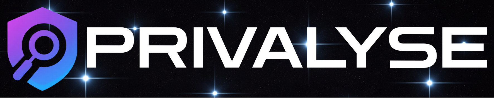

<p align="center">
  
</p>

# 🔒 Privalyse – Catch Privcay Leaks in AI-Assisted Codebases

[](LICENSE)
[](https://pypi.org/project/privalyse-cli/)
[](https://www.python.org/downloads/)
[](https://x.com/privalyse_dev)

> **Code is a black box. Data moves through invisible paths.**
> **Privalyse makes these paths explicit.**

We are generating code faster than ever, but we are losing sight of where our data actually goes.
LLMs write logic, but they don't see the flow. They happily pipe PII into logs, send secrets to third-party APIs, or expose internal state.

**Privalyse is not just a linter.** It builds a **Semantic Data Flow Graph** of your application to tell **Flow Stories**:
*   ❌ *Traditional Linter:* "Variable `user_email` used in line 42."
*   ✅ *Privalyse:* "User Email (Source) → Prompt Template → OpenAI API (Sink) → Logs (Leak)."

With its deterministic static analysis engine, it serves as the perfect counterpart to **AI-assisted coding**: ensuring reproducible results and providing a safety net to recheck your entire codebase before deployment.

⭐️ Star if you believe in visible data flows.

**🚀 Alpha Release** - We're building the privacy scanner that modern development deserves. Zero config, instant insights, built for speed.

📚 [Quick Start](#quick-start) • 🔍 [What We Detect](DETECTION_RULES.md) • 🗺️ [Roadmap](#roadmap) • 🐛 [Report Bug](https://github.com/privalyse/privalyse-cli/issues) • ✨ [Request Feature](https://github.com/privalyse/privalyse-cli/issues)

```bash
pip install privalyse-cli
privalyse
# ✅ Done. Markdown report ready (scan_results.md).
```

---

## Installation

```bash
pip install privalyse-cli
```

## Quick Start

```bash
# Scan current directory (defaults to Markdown output)
privalyse

# Scan specific folder
privalyse --root ./backend

# Output as JSON (Structured)
privalyse --root ./backend --format json --out results.json

# Output as HTML (Visual Dashboard)
privalyse --root ./backend --format html --out report.html
```

## 🎥 See It In Action


## 📊 Example Reports

See how Privalyse analyzes different types of projects:

| Project Type | Description | Report |
|--------------|-------------|--------|
| **Bad Practice App** | A vulnerable app full of security holes and GDPR violations. | [View Report](https://github.com/privalyse/privalyse-cli/blob/main/examples/bad-practice-app/scan_results.md) |
| **Modern Fullstack** | A typical React/Node.js stack with some common issues. | [View Report](https://github.com/privalyse/privalyse-cli/blob/main/examples/modern-fullstack-app/scan_results.md) |
| **Best Practice App** | A secure, compliant application following GDPR standards. | [View Report](https://github.com/privalyse/privalyse-cli/blob/main/examples/best-practice-app/scan_results.md) |


---

## ⚡ Try It Now (30 seconds)

**No installation needed** - works in any Python project:

```bash
pip install privalyse-cli && privalyse --root . --out report.md && cat report.md | head -50
```

🎯 **Boom. Privacy report generated in 3 seconds.**

---

## 🤖 AI Agent Integration

Privalyse is designed to be "Agent-Ready". If you are building an AI coding agent or using LLMs to fix code, Privalyse provides structured, context-rich output that agents can understand.

### For Coding Agents
When using Privalyse as a tool for an agent:
1.  **Run with JSON output**: `privalyse --format json --out report.json`
2.  **Parse the `findings` array**: Each finding now includes:
    *   `code_context`: The actual lines of code (with surrounding context) where the issue was found.
    *   `context_start_line` / `context_end_line`: Precise line numbers.
    *   `suggested_fix`: A human-readable suggestion for fixing the issue.
    *   `confidence_score`: To help the agent decide whether to act.

### Example JSON Output for Agents
```json
{
  "rule": "HARDCODED_SECRET",
  "file": "src/config.py",
  "line": 15,
  "severity": "critical",
  "suggested_fix": "Move secret to environment variable (os.environ.get) or secrets manager.",
  "confidence_score": 1.0,
  "code_context": [
    "def connect_db():",
    "    db_password = \"super_secret_password_123\"  # <--- Finding here",
    "    return connect(password=db_password)"
  ]
}
```
This allows agents to **self-correct** code without needing to read the file separately.

---

## What It Does

Privalyse performs static analysis to detect:

- **Hardcoded Secrets**: API keys, passwords, tokens in source code
- **PII Leakage**: Personal data in logs, print statements, and debug output
- **Insecure Data Flows**: Tracking where user data moves across your codebase
- **GDPR Violations**: Mapping findings to specific GDPR articles (Art. 5, 6, 9, 32)
- **Security Misconfigurations**: HTTP vs HTTPS, CORS, security headers

The scanner uses AST (Abstract Syntax Tree) parsing for both Python and JavaScript/TypeScript to ensure deep understanding of your code structure.

## Features

- **Python & JavaScript/TypeScript** support
- **AST-based analysis** for Python and JS/TS (deterministic, deep data flow tracking)
- **Cross-file taint tracking** (follows data flows across imports and modules)
- **Cross-stack tracing** (links Frontend API calls to Backend routes)
- **GDPR article mapping** (Art. 5, 6, 9, 32)
- **Structured Reports** (Executive Summary, Compliance View, File Hotspots)
- **Multiple output formats** (JSON, Markdown, HTML)
- **Ignore file support** (`.privalyseignore` for false positives)
- **100% Local Execution** (no code leaves your machine)

---

## 💡 Why Privalyse?

We believe **security shouldn't be a question of price**. Everyone deserves data safety and secure code. That's why Privalyse is **MIT Licensed** and free to use.

### 1. The "Audit-Ready" Approach
**Don't just find bugs—generate documentation.**
When your CTO asks *"Are we GDPR compliant?"*, you can't send them a JSON file. Privalyse generates reports you can actually hand to your Data Protection Officer (DPO).

### 2. Focus on Data Flows
**We find problems even in massive codebases.**
Privalyse goes beyond simple pattern matching by implementing **Cross-File & Cross-Stack Taint Tracking**. It traces the journey of sensitive data throughout your application—from database models to API endpoints, across network calls to the frontend, and finally to sinks like logging or third-party APIs. By understanding how modules and services interact, we can detect when a variable defined in one file is insecurely used in another, effectively connecting the dots across your entire project structure.

*Note: Visual data flow graphs are on the Roadmap!*

### 3. The Human-in-the-Loop
The Markdown results are perfect for reviewing AI-generated code before merging. This helps keep control where it really counts.
**The Problem:** ChatGPT just wrote 500 lines. Did it leak user emails into logs?
**The Solution:** `privalyse scan ./new-feature --format markdown`

## 🎯 Use Cases

### For Developers
- ✅ **Review AI-Generated Code:** Catch hardcoded secrets and PII leaks before merging.
- ✅ **Clean Up Debug Code:** Find forgotten `print()` and `console.log()` statements.
- ✅ **Learn GDPR:** Understand privacy requirements while you code.

### For Security Teams
- ✅ **Quick Audits:** Generate compliance reports in seconds.
- ✅ **Track Progress:** Monitor privacy improvements over time.
- ✅ **CI/CD Integration (Roadmap):** Catch issues early in the pipeline. 

## 🗺️ Roadmap

**Current (Alpha v0.1):**
- ✅ Python & JavaScript/TypeScript analysis
- ✅ Cross-file taint tracking
- ✅ GDPR article mapping (Art. 5, 6, 9, 32)

- ✅ JSON, Markdown, HTML export
- ✅ `.privalyseignore` support

**Next Up:**
- 🔜 **Data Flow display**
- 🔜 **Smarter detection** Improving the rules and patterns.
- 🔜 **More Compliance Standards** (CCPA, HIPAA, etc.)
- 🔜 **GitHub Actions integration** (CI/CD ready)

- 🔜 **Enhanced test coverage**

**Vision (Future):**
- 🎯 **Multi-language** (Java, Go, Ruby, C#)
- 🔜 **VS Code extension** (lint as you code)
- 🎯 **Team features** (shared reports, trends)
- 🎯 **AI-assisted fixes** (not just detection)
- 🎯 **Pre-commit hooks**

---

## Contributing

We're building this in the open. Contributions welcome!

- Report bugs or suggest features via [Issues](../../issues)
- See [CONTRIBUTING.md](CONTRIBUTING.md) for guidelines

---

## License & Disclaimer

MIT License - See [LICENSE](LICENSE) for details.

⚠️ **Alpha Software**: Privalyse helps identify privacy issues but:
- Does not guarantee complete GDPR compliance
- Not a substitute for legal counsel
- Should be part of a broader security strategy
- May have false positives/negatives as we improve

Always consult privacy professionals for compliance decisions.

---

<p align="center">
  <strong>Built by developers who care about privacy.</strong><br>
  <a href="../../issues">Report a bug</a> • <a href="../../issues">Request a feature</a> • <a href="CONTRIBUTING.md">Contribute</a>
</p>
